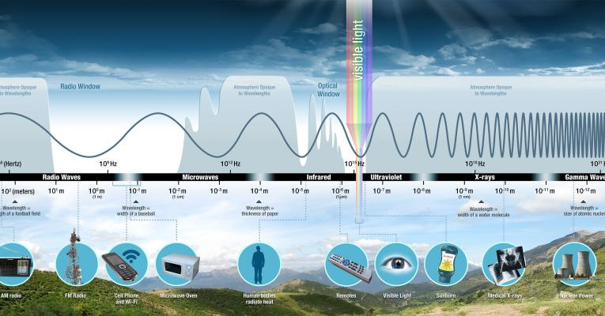

\mainmatter

<!-- # (PART\*) PARTE I: PRELIMINARES {-} -->

# (PART\*) PARTE I: PRELIMINARES {-}

# Introducción a Percepción Remota con R

## Un curso diminuto de R {#crashCourseR}

La web está cargada de tutoriales, blogs, libros y demás materiales que hacen un gran trabajo en explicar a detalle cada una de las componentes de R. Aquí sólo abordamos, a través de ejemplos, las herramientas necesarias para poder dar seguimiento a los capítulos subsecuentes.

En R utilizamos **objetos** para trabajar. Hay distintos tipos de objetos: ```vector```, 
```matrix```, ```data.frame```, ```array``` y ```list```. Cada objeto tiene un 
atributo intrínseco denominado ```mode``` el cual especifica el tipo de dato almacenado
en el objeto. Algunos tipos de datos son: ```numeric```, ```integer```, ```character``` 
y ```logic```.

Es seguro decir que todo objeto de R tiene estructura de ```vector```; todo objeto 
```matrix``` es un vector en dos dimensiones; un objeto ```data.frame``` es esencialmente 
un objeto ```matrix``` cuyas entradas no están restrigidas a ser de mode ```numeric```; 
un objeto ```array``` puede pensarse como un objeto ```matrix``` con más de dos 
dimensiones y un objeto ```list``` es ampliamente versátil ya que en él podemos 
almacenar cualquier tipo de objeto. 

Para definir un objeto en R sólo debemos utilizar un nombre informativo y _asignar_
a este nombre el dato de interés. La asignación se realiza mediante el uso de los 
símbolos ```<-```. Por ejemplo, en las siguientes líneas definimos los objetos 
```primeros_6_meses``` y ```numero_par_menor_igual_12```:

```{r}
primeros_6_meses <- c("Enero", "Febrero", "Marzo", "Abril", "Mayo", "Junio")
numero_par_menor_igual_12 <- c(2,4,6,8,10,12)
```

Arriba hemos usado el símbolo ```c()```, el cual abre la puerta para discutir
otra parte importante en R: las _funciones_. Una función es una serie de instrucciones 
escritas con el fin de realizar alguna tarea. Estas instrucciones dependen de una 
serie de parámetros. En R los parámetros de las funciones se denominan _argumentos_. 
Las tareas que una función puede realizar son vastas. Hay funciones que regresan 
objetos de R, otras que devuelven _métodos_ tales como un resumen o una gráfica, 
y hay otras funciones que permiten la exportación de objetos hacia archivos en 
formatos utilizables en otros programas de cómputo.

Cada función de R posee una _documentación_ lo cual distingue a este lenguaje de 
programación de muchos otros. Para acceder a la documentación de una función de 
interés se puede emplear la función ```help()``` -o su versión corta ```?```. Por 
ejemplo, para conocer mejor a la función ```c()``` podemos teclear ```help(c)``` 
en consola, presionar la tecla ENTER y obtener información referente al **Title**, 
**Description**, **Usage**, **Arguments**, **Details**, **Value**, **References** 
y **Examples** de la función ```c()```.

Para garantizar el correcto funcionamiento de cualquier función es vital conocer 
la _clase_ de cada uno de sus argumentos. La función ```class()``` permite conocer 
la clase asignada a un objeto; 
si no se ha modificado su clase, por convención, la clase de un objeto es su
```mode```. Otras funciones útiles para conocer las características de un objeto 
son ```length``` y ```str```. La función ```length``` devuelve la longitud de un 
objeto. La función ```str()``` devuelve tanto la clase como la longitud de un 
vector.^[El símbolo ```;``` permite ejecutar varias instrucciones en una sola línea de comando.]

```{r}
class(primeros_6_meses); length(primeros_6_meses); str(primeros_6_meses)
str(numero_par_menor_igual_12)
```

A continuación combinaremos las funciones ```getwd()```, ```paste0()``` y ```read.csv()``` 
para leer el archivo ```ensenada.csv``` el cual se encuentra en el subdirectorio 
```/data``` del directorio de trabajo de este proyecto.

```{r}
ensenada <- read.csv( paste0( getwd(), "/data/ensenada.csv" ) )
str(ensenada)
```

El objeto ```ensenada``` es un ```data.frame``` con 8 variables cada una con 12 
observaciones.^[```P``` es de precipitación, ```Tmin```, ```Tmax``` y ```Tprom``` 
son de temperatura mínima, max y promedio, respectivamente, mientras ```Evapo``` 
y ```PCvid``` son de evapotranspiración y cosecha de uva.]


Para acceder a las variables de un ```data.frame``` podemos usar el símbolo ```$```. 
Por ejemplo, a partir de las variables ```Tmax``` y ```Tmin``` podemos obtener el _rango_
de la temperatura:

```{r}
ensenada$Trango <- ensenada$Tmax - ensenada$Tmin
```

Nota que arriba hemos generado la variable ```Trango``` y de manera dinámica la 
hemos agregado al objeto ```ensenada```. El cálculo del rango ha sido inmediato 
debido a que las _operaciones aritméticas_^[Teclea ```?Arithmetic``` para conocer 
más sobre este tipo de operadores.] básicas entre vectores se realizan entrada a 
entrada; en algunos lenguajes de programación el cálculo de la variable rango 
requiere del uso de un bucle informático. 

Un ```data.frame``` es esencialmente una ```matrix``` cuyas columnas tienen nombres 
predeterminados y cuyas entradas pueden ser tanto ```numeric``` como ```character``` 
ó ```logic```. De modo que para acceder a partes o secciones de un ```data.frame``` 
podemos utilizar las posiciones de sus renglones y columnas. Por ejemplo, si necesitáramos 
únicamente la información contenida en los primeros 4 renglones y en las columnas 
1, 4 y 7 de ```ensenada``` podemos teclear:

```{r}
ensenada[1:4,c(1,4,7)]
```

También podemos usar _operadores relacionales_^[Teclea ```?Comparison``` para conocer 
más sobre estos operadores.] para acceder a bloques de datos. Por ejemplo, 
si tuviéramos interés en retener todas las variables de ```ensenada``` pero únicamente 
aquellas observaciones en donde la temperatura promedio es mayor que 20 grados 
podemos teclear:

```{r}
ensenada[ensenada$Tprom > 20,]
```

R fue concebido como un software estadístico y por tanto cuenta con múltiples funciones
y _paquetes_ destinados al análisis estadístico de datos. Por ejemplo, 
al calcular la correlación lineal entre las variables ```dias``` y ```P```, descubrimos 
que ésta es alta (~0.88) lo que nos dá pie a ajustar una regresión lineal entre estas
variables. Finalmente graficamos nuestros hallazgos. Acá el código:

```{r}
(COR <- cor(ensenada$dias, ensenada$P))
fit <- lm(ensenada$P ~ ensenada$dias)
yr <- range(ensenada$P)
yr[1] <- yr[1] - 1.25
yr[2] <- yr[2] + 1.25

par(mar = c(5, 5, 3, 2))
plot(ensenada$dias, ensenada$P, main = "Días de lluvia / Precipitación",
     ylim = yr, xlab = "Días de lluvia", ylab = "Precipitación mensual (mm)", 
     col = "darkblue", bg = "blue", pch = 16, cex = 1.2, cex.lab = 1.2, 
     cex.axis = 1.2)
lines(fit$model$`ensenada$dias`, fit$fitted.values)
legend("topleft", legend = c(paste("correlación:", round(COR,4))), bty = "n")
```

Arriba hemos utilizado varios parámetros de las funciones ```par()```^[La lectura de la documentación de esta función es ampliamente recomendada] y ```plot()``` para producir una gráfica 
atractiva e informativa.

Hasta este punto hemos definido y usado objetos de tipo ```vector```, ```data.frame``` 
y ```list```. Más aún estos objetos almacenan distintas estructuras de datos tales 
como ```character``` ó ```numeric```. 
Resulta que podemos _almacenar_ todos estos objetos distintos en un solo objeto 
de tipo ```list```; ésta es quizás la principal virtud de este tipo de objetos. 
En efecto,

```{r}
LISTA <- list(primeros_6_meses, numero_par_menor_igual_12, ensenada, fit)
```
Nota que R distingue entre minúsculas y mayúsculas, es decir si ahora desearas 
utilizar el objeto ```lista``` seguramente recibirías el mensaje ```Error: object 'lista' not found.```

Concluimos esta sección guardando el producto de nuestro trabajo, actualmente 
almacenado en el objeto ```LISTA```, en un archivo ```.RData``` -el formato nativo 
de R.^[Nota que en el directorio ```/data``` se ha generado el archivo 
```salida-cursoCortoR.RData```. Para leer este archivo puede emplearse la función 
```load()```.]

```{r}
save(LISTA, file = paste0( getwd(), "/data/salida-cursoCortoR.RData" ))
```


## Un curso esencial de Percepción Remota con R {#crashCoursePR}

Antes de iniciar nuestra breve discusión sobre percepción remota dejemos nuestros sistemas listos para manejar información _geo-referenciada_. Es decir, instalemos los _paquetes_ de R que serán usados en este proyecto. Un paquete de R es una serie de funciones escritas con la intención de resolver múltiples problemas asociados a un tema específico y que han sido empaquetadas para su fácil distribución y uso.

Hay decenas de miles de paquetes para el manejo y análisis de información geo-referenciada con R, nosotros haremos uso de los siguientes:

  - ```rgdal```, ```raster```, ```RColorBrewer```, ```sp```, ```sf```, ```mapview```, ```geoTS```, ```terra```

Para instalar un paquete de R en RStudio podemos utilizar la opción _Install_ 
del menú _Packages_ y teclear el nombre del paquete en el cuadro de diálogo que 
se muestra. Alternativamente, podemos utilizar la función ```install.packages()``` 
en consola. Recuerda que una vez instalado hay que habilitar el paquete para su 
uso en la sesión de trabajo utilizando la función ```library()```. Ahora sí, a 
la ¡percepción remota!

Existen libros de texto que abordan la percepción remota desde el punto de vista 
de la física, las matemáticas, las ciencias de la tierra y hasta el de la geo-computación. 
Aquí presentaremos los elementos _esenciales_ para navegar el amplio mar de la 
percepción remota usando R.

De manera muy suscinta, los sujetos de estudio de la percepción remota son todos
aquellos cuyos atributos pueden ser registrados a distancia a través de algún 
instrumento especializado. Por ejemplo, se puede contar el número de ejemplares 
de alguna especie animal a través de la técnica de foto trampeo; se puede medir 
las reservas de agua en cuencas hidrológicas con imágenes satelitales, etc.
<!-- (número de ejemplares de alguna especie animal, número de accidentes vehiculares en la intersección de dos avenidas con alto tráfico, reserva de agua en cuencas hidrológicas, etc.)  (fototrampeo, video cámaras, imagen satelital, etc.). -->

Las ideas que discutiremos a continuación son aplicables a muchos acervos de 
información _geo-referenciada_, sin embargo, utilizaremos imágenes MODIS y Landsat 
-acervos de acceso gratuito y de amplio uso- para ejemplificar algunos conceptos.    

### MODIS

[MODIS](https://modis-land.gsfc.nasa.gov/MODLAND_grid.html) son las siglas en 
inglés de MODerate resolution Imaging Spectroradiometer el cual es un sensor puesto 
en órbita por la NASA en diciembre de 1999 y que continúa en uso. Existen distintos 
_productos_ MODIS desarrollados con la finalidad de cuantificar aerosoles, verdor, 
nieve, puntos de calor, etc. Cada producto tiene un _nivel de procesamiento_ y 
éstos van desde el nivel cero (**raw data**) hasta el nivel tres (**modeled**); 
en este proyecto trabajaremos con imágenes procesadas a nivel uno o dos. Los productos 
MODIS -a distintas resoluciones, 250 m, 500 m, 1 km- se distribuyen como 
_imágenes satelitales_ a través de los repositorios de la NASA.

En el subdirectorio ```/data/imagenMODIS``` tenemos una copia de una imagen MODIS.
Para _cargar_ esa imagen a nuestra sesión de trabajo iniciamos definiendo un puente
confiable para acceder a todos los archivos .tif en ```/data/imagenMODIS```:

<!-- un objeto con el nombre de todos los archivos .tif en ```/data/imagenMODIS```: -->

```{r, warning=FALSE, eval=FALSE}
dir_imagen_modis <- list.files( path=paste0(getwd(), "/data/imagenMODIS"), 
                                pattern=".tif", full.names=TRUE )
```

Creando un objeto como ```dir_imagen_modis``` podemos, por ejemplo, estar seguros 
que no incurriremos en un error tipográfico que nos impida acceder a el(los) archivo(s), deseado(s).

<!-- Con un objeto como ```dir_imagen_modis``` estamos creando de modo eficiente un  -->
<!-- puente confiable para acceder a los archivos .tif de interés; por ejemplo, podemos  -->
<!-- estar seguros que no incurriremos en un error tipográfico que nos impida acceder  -->
<!-- al archivo, o archivos, deseado. -->

Posteriormente, usamos la función ```raster()``` para _leer_ el contenido del archivo 
.tif y asignarlo a un objeto. Al usar ```raster()``` para leer un archivo, el contenido 
de éste se almacena **virtualmente** en algún directorio temporal de tu sistema. 
La principal virtud de esta característica es que archivos de gran tamaño (del orden 
de giga bytes) pueden manejarse en R sin causar un _memory overflow_.

```{r, warning=FALSE, eval=FALSE}
modis <- raster( dir_imagen_modis[1] )
```

```{r, warning=FALSE, echo=FALSE}
dir_imagen_modis <- list.files( path=paste0(getwd(), "/data/imagenMODIS"), 
                                pattern=".tif", full.names=TRUE )
modis <- raster( dir_imagen_modis[1] )
```

Para tener un resumen del contenido del objeto ```modis``` simplemente ejecutamos
```{r}
modis
```

A partir de este resumen aprendemos que el objeto ```modis``` pertenece a la clase 
```RasterLayer``` y tiene 291 (renglones) por 214 (columnas) celdas o **píxeles**.
La resolución, o área efectiva cubierta por cada píxel, es de 924.5661 m por 926.336 m.^[De hecho para simplificar las cosas, se reporta que la resolución de este producto es de 1 km.] 
También forman parte de este resumen las coordenadas del rectángulo que define la 
extensión de este ráster (```extent```), el sistema de coordenadas utilizado para 
geo referenciar la imagen (```crs```) así como sus valores máximos y mínimos (```values```).

Conocemos también el nombre del archivo .tif (```source```) el cual nos revela 
información sobre el producto adquirido ([MOD13A2](https://lpdaac.usgs.gov/products/mod13a2v006/)), 
el día juliano de la adquisición de la imagen (```A2020001```), el identificador 
del mosaico ó _tile_^[Ver [Sinusoidal Tile Grid](https://modis-land.gsfc.nasa.gov/MODLAND_grid.html).] 
asignado al área geográfica registrada por la imagen (```h08v06```), la versión 
del producto (```006```), el día juliano del procesamiento de la imagen (```2020018001221```), 
la resolución espacial y temporal del producto (```1_km_16_days```) y, en este caso, 
la variable geo física registrada en esta imagen, el [Normalized Difference Vegetation Index](https://gisgeography.com/ndvi-normalized-difference-vegetation-index/), (```NDVI```).

La presentación del NDVI, un índice de vegetación, motiva la discusión de qué mide 
y -más importante aún- cómo se calcula este índice. Para iniciar tal discusión debemos 
hablar de **bandas espectrales** y como este concepto es inherente a cualquier 
imagen óptica satelital, usaremos como ejemplo una escena registrada con el sensor Landsat.

### Landsat

Dentro de los proyectos enfocados a monitorear la cobertura de la Tierra por medio 
de imágenes satelitales, la misión [Landsat](https://landsat.gsfc.nasa.gov/) es 
la más longeva. [Landsat 1](https://landsat.gsfc.nasa.gov/satellites/landsat-1/) 
fue puesto en órbita en julio de 1972^[Fun fact: Una imagen Landsat 1 es parte importante en la trama de la película [Kong: Skull Island](https://en.wikipedia.org/wiki/Kong:_Skull_Island).] 
y desde entonces NASA y sus aliados han puesto en órbita 9 satélites que permiten 
monitorear la Tierra con imágenes de resolución moderada (30 m); la misión 
[Landsat 9](https://landsat.gsfc.nasa.gov/satellites/landsat-9/) fue lanzada 
exitósamente en septiembre de 2021 y desde mediados de febrero de 
2022 las imágenes provenientes de este sensor estén disponibles al público.

En el directorio ```/data/escenaLandsat8``` tenemos copia de una _escena_ registrada 
por el satélite Landsat 8.

```{r}
dir_escena_landsat8 <- mixedsort(list.files( path=paste0(getwd(),
                                                         "/data/escenaLandsat8"), 
                                pattern=".tif", full.names=TRUE ))
dir_escena_landsat8
```

<!-- , cada uno registrando valores de la -->
<!-- reflectancia de la superficie y empaquetándolos en una _banda espectral_.  -->
Esta escena está conformada por 11 archivos. Cada archivo registra los valores de 
la reflectancia de la superficie en una rango específico, también denominado _banda espectral_.
Pero, ¿qué es una banda espectral, Rick? Hasta ahora hemos mencionado que los 
sensores sirven para monitorear la Tierra. Siendo más precisos debemos decir que 
los sensores ópticos registran la radiación solar reflejada por la superficie terrestre. 
De acuerdo a la teoría ondulatoria de la radiación electromagnética, ésta se transmite de 
un punto a otro de un modo **contínuo** y **periódico**. 

<div class="centered">
  {width=50%, height=35%}
</div>

Registrar un proceso continuo requiere de instrumentos de medición de alta precisión. 
También es plausible que intentar almacenar estos registros continuos demande espacios 
físicos de gran tamaño. Afortunadamente, la misma teoría ondulatoria asegura que 
la radiación electromagnética tiene características similares en determinados 
intervalos o **bandas espectrales**; la organización de estas bandas se denomina 
**espectro electromagnético**. De modo que siendo laxos, podemos pensar que las 
bandas espectrales son una versión discretizada del continuum hipotetizado por la 
teoría ondulatoria de la energía.

Típicamente, las unidades de medida de la reflectancia se asocian con la _longitud de onda_ (distancia 
entre los picos de dos ondas consecutivas). Las longitudes más cortas se miden 
en micrométros mientras que las más largas en centímetros, véase la Figura 1. El 
espectro electromagnético es visible para el ojo humano en ciertas regiones o bandas. 
Estas bandas reciben nombres comunes como azul, verde y rojo. 

Para Landsat 8 las bandas 2, 3 y 4 corresponden al azul, verde y rojo visible. 
Apilaremos los archivos de nuestra escena Landsat 8 en un objeto de la clase ```RasterStack```.

```{r}
landsat8 <- stack(dir_escena_landsat8)
landsat8
```

```landsat8``` tiene 11 capas (```nlayers```), una capa por archivo enlistado en 
```dir_escena_landsat8```. La resolución de las imágenes de esta escena es de 30 m; 
esta ganancia en la resolución es directamente proporcional al número de píxeles en 
este tipo de imágenes. Consideremos ahora el nombre de la primera capa de ```landsat8```

```{r}
names(landsat8[[1]])
```

Aquí tenemos el nombre del producto (```LC08```), el **path-row** (```044034```)^[Mientras que la misión MODIS utiliza los ejes horizontal y vertical como referencia al segmentar la Tierra, 
la misión Landsat llama a estos ejes path-row.], el día juliano de adquisición (```20170614```) 
y el nombre genérico de la banda (```B1```). 

Hagamos un mapa interactivo con la segunda capa de ```landsat8```.

```{r, warning=FALSE}
azul <- subset(landsat8,2)
mp <- mapview(azul)
mp
```


A partir de este mapa notamos que la escena Landsat cubre una región entre los 
condados de Concord y Stockton en California. Modificando algunos argumentos de 
la función ```mapview()``` podríamos conseguir una mejor visualización de la banda 
del azul de ```landsat8```, sin embargo, en este punto optaremos por conocer mejor
la manera en la que la información contenida en las bandas espectrales se relaciona 
con la cobertura terrestre.

Para simplificar la siguiente discusión, de las 11 bandas de ```landsat8``` consideremos
únicamente las primeras 7 y asignemos nombres comunes a estas bandas:

```{r}
landsat8_1_7 <- subset(landsat8, 1:7)
names(landsat8_1_7) <- c("ultra-azul", "azul", "verde", "rojo", "NIR", "SWIR1", "SWIR2")
```

Continuamos con la creación de un subconjunto -un raster más pequeño, también 
llamado _crop_- de ```landsat8_1_7```. Para esto utilizamos un objeto de clase
```Extent``` y la función ```crop```.

```{r}
newExtent <- extent(624387, 635752, 4200047, 4210939)
landsat8_crop <- crop(landsat8_1_7, newExtent)
```

En la siguiente gráfica mostramos las denominadas gráficas en color verdadero
y en color falso aplicadas a ```landsat8_1_7``` y ```landsat8```, respectivamente.
Estas gráficas usan la escala **RGB** para facilitar la identificación de cultivos,
suelo desnudo, infraestructura, etc. Por ejemplo en la gráfica de color verdadero
podemos distinguir zonas de asentamientos humanos, un cuerpo de agua y áreas verdes.
Esto último es tambíen identificado en la gráfica de falso color ya que en este tipo
de gráficas el color rojo se asocia a la presencia de vegetación. También podemos
validar estas apreciaciones haciendo uso de la cartografía incluida en el mapa 
interactivo de arriba.

```{r landsat9-crop-RGB}
par(mfrow = c(1,1), mar = c(4.5, 5, 1.5, 2))
plotRGB(landsat8_1_7, r=4, g=3, b=2, axes = TRUE, stretch = "lin",  
        main = "Landsat8 True Color Composite")
plotRGB(landsat8_crop, r=5, g=4, b=3, stretch = "lin", add=TRUE)
```

En ```/data/rspatial``` tenemos el archivo _samples.rds_ el cual contiene información
geo referenciada sobre 5 clases de la cobertura del suelo en la zona cubierta por la 
escena ```landsat8```. 

```{r}
cobertura_suelo <- readRDS(paste0(getwd(), "/data/rspatial/samples.rds"))
str(cobertura_suelo@data)
unique(cobertura_suelo$class)
```

A continuación usaremos la función ```spsample()``` para tomar una muestra de 300 
puntos del objeto ```cobertura_suelo``` aleatoriamente. Posteriormente, aplicaremos 
```extract()``` para extraer los valores de las bandas de ```landsat8_1_7``` en 
las coordenadas de los puntos de la muestra.

```{r, warning=FALSE}
muestra_300_pts <- spsample(cobertura_suelo, 300, type = "random")
# agrega info de clases a los puntos de la muestra
muestra_300_pts$class <- over(muestra_300_pts, cobertura_suelo)$class
landsat8_cobertura <- extract(landsat8_1_7, muestra_300_pts)
```

Ahora agrupamos los valores extraídos de las bandas por clase de cobertura,
calculamos la media de cada grupo y las almacenamos en un objeto de tipo
```matrix``` para su posterior uso.

```{r, size="tiny", ou}
ms <- aggregate(landsat8_cobertura, list(muestra_300_pts$class), mean)
rownames(ms) <- ms[,1]
ms <- ms[,-1]
ms <- as.matrix(ms)
ms
```

La siguiente gráfica muestra que la reflectancia registrada por la banda 5 (NIR)
alcanza su máximo cuando el suelo está cubierto por cultivos. Similarmente,
para el mismo tipo de cobertura del suelo, la reflectancia de la banda 4 (rojo) 
alcanza su valor mínimo. 

```{r}
mycolor <- c("darkred", "darkgreen", "burlywood", "cyan", "blue")
plot(0, ylim = c(0, 0.6), xlim = c(1,7), type = "n", xlab = "Bandas", 
     ylab = "Reflectancia")

for (i in 1:nrow(ms)) {
  lines(ms[i,], lwd = 3, col = mycolor[i])
}

title(main = "Perfil espectral de Landsat8", font.main = 2)
legend("topleft", rownames(ms), cex = 0.8, col = mycolor, lwd = 3, bty = "n" )
```

Observe que en la clase _cropland_ si calculamos la diferencia entre los valores
de cualesquiera dos bandas, la diferencia ```NIR-rojo``` es la más grande. Esta 
característica sugiere que la construcción de un índice de vegetación puede basarse
apropiadamente en la normalización de la diferencia ```NIR-rojo```. En efecto,
el NDVI se define como

\begin{equation}
  NDVI = \frac{NIR-rojo}{NIR+rojo}
\end{equation}

Note que el valor del NDVI estará restringido al intervalo [-1,1]. Esto facilita
su interpretación: típicamente, valores altos del NDVI (>= 0.4) indicarían presencia 
de verdor mientras que valores bajos de este índice (< 0) sugerirían ausencia del
mismo. Concluimos con un mapa dinámico del NDVI para la escena Landsat 8
discutida en esta sección.

```{r, warning=FALSE, fig.align='center', fig.width=8}
NDVI <- (landsat8_1_7$NIR-landsat8_1_7$rojo)/(landsat8_1_7$NIR+landsat8_1_7$rojo)
mp_NDVI <- mapview(NDVI, col.regions=rev(terrain.colors(10)))
mp_NDVI
```


