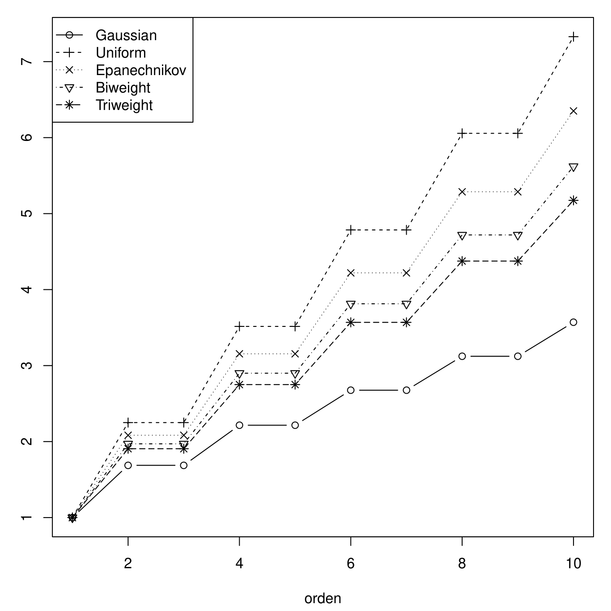

# Análisis de forma {#shapeAnalysis}


En esta sección vamos a discutir algunas ideas alrededor de la interesante tarea
de extraer las principales características de algunas series de tiempo de imágenes
satelitales. Las características que tenemos en consideración van desde los mínimos
y máximos por temporada, hasta los puntos de inflexión en las series anuales. En
el caso de la vegetación, estos puntos de inflexión recientemente han sido considerados
como estimadores de fechas determinantes en el denominado ciclo fenológico.

Para efectos de extraer estas características, visitaremos varios métodos estadísticos
de suavización de curvas y algunos modelos de regresión _no paramétrica_. Consideramos
que no existe una técnica universal para la estimación de las características de cualquier
variable biofísica por lo que el título de este capítulo más que apuntar al uso de
técnicas del denominado _análisis estadístico de forma_, busca catalogar una serie 
de problemas y sus estrategias de solución en un mismo apartado.

Recomendamos asegurarse de incluir las siguientes líneas en el preámbulo de su sesión 
de trabajo en R:

```{r libraries-2}
library(forecast)
library(sta)
```

ya que en algunos de estos paquetes se encuentran las bases de datos que utilizaremos 
en esta sección.

## Smoothing

El paquete ```sta``` contiene el vector ```marismas``` el cual presenta observaciones
del índice de humedad de diferencia normalizada (**NDMI**) tomadas en algún punto del Área
Natural Protegida Marismas durante el periodo 2000-2018, véase la Figura \@ref(fig:marismas).

```{r marismas, echo=FALSE, fig.width=5, fig.height=4, fig.cap = "Serie de tiempo de compuestos a 10 días del NDMI registrada en Marismas Nacionales, México, durante el periodo 2000-2018.", fig.pos="h", out.width='.6\\linewidth'}
marismas_ts <- ts(marismas, start=c(2000,1), end=c(2018,36),
                  frequency=36)

plot(marismas_ts, ylab="NDMI")
```

A largo plazo podemos apreciar la dinámica periódica de este NDMI. Por el momento
concentrémonos en algún año específico, digamos el año 2000.

```{r marismas2000, echo=FALSE}
marismas_ts_2000 <- ts(marismas[1:36], start=c(2000,1), end=c(2000,36), frequency=36)

plot(marismas_ts_2000, ylab="NDMI")
```

Existe un cambio súbito en el valor nominal del NDMI justo después de alcanzar su 
máximo. Además, a partir de esta gráfica -y las observaciones originales- podría
resultar complicado, por ejemplo, establecer el punto en el tiempo en el que el 
valor de NDMI muestra un crecimiento sostenido. Para simplificar las cosas podemos 
optar por aproximar la serie de tiempo original con una versión _más suave_.

La Figura \@ref(fig:marismas-ma) muestra el NDMI del año 2000 y dos suavizadores
por medias móviles. El suavizador por media móvil de orden 2 otorga un aspecto menos
súbito al cambio entre el valor máximo de NDMI y el valor subsecuente. Con el suavizador
por media móvil de orden 6 el cambio mencionado es apenas perceptible, sin embargo,
por definición este suavizador no está definido -no hay valores- para las primeras
y últimas 6 observaciones. 
```{r marismas-ma, echo=FALSE, fig.width=5, fig.height=4, fig.cap = "Compuestos a 10 días del NDMI registrada en Marismas Nacionales en 2000 junto suavizadores de medias móviles.", fig.pos="h", out.width='.6\\linewidth'}
marismas_ts_2000 <- ts(marismas[1:36], start=c(2000,1), end=c(2000,36),
                       frequency=36)

ma_marismas_2000_2 <- ma(marismas_ts_2000, order=2, centre = TRUE)

ma_marismas_2000_4 <- ma(marismas_ts_2000, order=6, centre = TRUE)

yRan <- range(marismas_ts_2000, ma_marismas_2000_4, na.rm = TRUE)

par(mfrow=c(1,2))
par(mar = c(2,2,1,2), adj = 0)
plot(marismas_ts_2000, ylab="NDMI", ylim=yRan, main="MA(2)")
par(new=TRUE)
plot(ma_marismas_2000_2, ylab="NDMI", ylim=yRan, lty=3, col="red")

plot(marismas_ts_2000, ylab="NDMI", ylim=yRan, main="MA(6)")
par(new=TRUE)
plot(ma_marismas_2000_4, ylab="NDMI", ylim=yRan, col="red", lty=3)
```

Numéricamente sería posible determinar mínimo, máximo y hasta puntos de inflexión 
de cualquiera de estos suavizadores. Sin embargo, podemos explotar la estructura
local de las observaciones y aplicar un modelo estadístico a partir del cual realizar
_inferencias_ es una tarea sencilla.


## Regresión armónica y selección de modelo

En una nota anterior presentamos el modelo de regresión armónica con errores
cuya variabilidad es constante y discutimos criterios empíricos para decidir
el número de frecuencias/armónicos utilizados en el ajuste de este modelo a datos
de NDVI. En esta sección consideramos el mismo modelo de regresión suponiendo que los errores son heteroscedásticos y presentamos el criterio de información de Akaike (AIC en
inglés) el cual nos permite seleccionar el modelo con el mejor balance entre
el número de parámetros y la verosimilitud.

Usemos $y_t$ para denotar el valor del NDVI al tiempo $t$ y consideremos el siguiente modelo
\begin{equation}
    y_{t} = f(t) + \varepsilon_t,\qquad t=1,\ldots,L, (\#eq:WLS-HR)
\end{equation}
donde $f$ denota una función que definiremos abajo y suponemos que los errores $\varepsilon_t$ son normales con media cero y varianza $\sigma_t^2$, es decir la varianza toma valores distintos en cada punto del tiempo.

Consideramos que el modelo de regresión armónica con errores heteroscedásticos
intenta describir mejor la dinámica anual del NDVI. Por ejemplo, en el folder
```/data/phenoParams``` tenemos un dataset con 128 píxeles de NDVI, al tomar 
cualquiera de estos píxeles y graficar su curva de climatología observamos 
características  distintas a lo largo de los 23 días del año (DOY en inglés):

```{r shape-climatology, fig.width=5, fig.height=4, fig.cap = "Curva de climatología.", fig.pos="h", out.width='.6\\linewidth', echo=FALSE}
path_polygons <- paste0(getwd(), "/data/phenoParams/polygons")

listFiles_polygons <- list.files(path=path_polygons,
                                 pattern=".RData",
                                 full.names=TRUE)

POLIGONO <- LoadToEnvironment(listFiles_polygons[1])$poly[[1]] * 1e-4

ROW <- sample(nrow(POLIGONO),1)

pixel_climatology <- climatology(x=POLIGONO[ROW,], lenPeriod=23)

COLORES <- c(brewer.pal(8,"YlGn")[8:5],
             brewer.pal(9,"BuGn")[4:1],
             brewer.pal(9,"Greens")[7:9], #3
             brewer.pal(9,"YlGn")[9], #1
             brewer.pal(11,"PRGn")[11:9], #3
             brewer.pal(9,"Greens")[7:9], #3
             brewer.pal(9,"BuGn")[9:5])

par(mar=c(4,3,1,2))
boxplot(pixel_climatology$matrix, col=COLORES)
```

En particular, las varianzas de cada boxplot son considerablemente distintas -la
diferencia entre alguna de ellas alcanza un orden de magnitud- lo cual sustenta
la heteroscedasticidad de los errores en el modelo \@ref(eq:WLS-HR).

```{r var-climatology, echo¿FALSE}
apply(pixel_climatology$matrix, 2, sd)
```

Para la función $f$ consideramos la representación
\[
  f(t) 
  = 
  \alpha_0 
  + 
  \sum_{j=1}^p\,\left( \alpha_j\,\cos( \frac{2\pi\,j\,t}{L} ) 
  + 
  \beta_j\,\sin( \frac{2\pi\,j\,t}{L} )  \right)
\]
El valor de $L$ es determinado por el número de observaciones por año, en nuestro
caso $L=23$. 


Definiendo $c_j=\sqrt{\alpha_j^2 + \beta_j^2}$ y 
$\varphi_j=\mbox{arctan}(\beta_j/\alpha_j)$, la representación de $f$ es equivalente
a
\[
  f(t)
  =
  c_0 
  + 
  \sum_{j=1}^p\,c_j\,\cos\left( \frac{2\pi\,j\,t}{L} -\varphi_j \right),
  \quad
  t=1,\ldots,L.
\]


Típicamente, los valores $c_j$ y $\varphi_j$ son llamados _amplitud_ y _ángulo de fase_.
Muchos estudios de NDVI han usado el supuesto $\sigma_t^2=\sigma^2$ -para todo $t$-
para modelar los errores. Además, es común usar $p=3$ or $p=4$, cf. @Eastman.etal.2009, 
para ajustar la función de regresión.

El modelo de regresión armónica con errores heteroscedásticos incorpora información
histórica del NDVI, a través de la estimación de $\sigma_t^2$, de una manera
sencilla la cual contribuye a obtener un mejor ajuste y una selección más transparente
del número de frecuencias/armónicas.

### Criterio de información de Akaike.

El modelo \@ref(eq:WLS-HR) puede escribirse en forma matricial
\[
    \bs{Y} = \bs{X}\,\bs{\beta} + \bs{\varepsilon},
\]
donde $\bs{Y}=(y_1,\ldots,y_L)$, $\bs{X}$ es la matriz $(L\times (2p+1))$ de diseño
cuyo $\ell$-ésimo renglón está dado por
\[
  \bs{X}[\ell,]
  =
    \begin{pmatrix}
    1 & \cos( \ell (2\pi)/L ) & \sin( \ell (2\pi)/L ) & \cdots  \cos( \ell (2\pi\, p)/L ) & \sin( \ell (2\pi\, p)/L )
    \end{pmatrix},
\]
y $\bs{\varepsilon}=N(\bs{0},\bs{\Sigma})$, $\bs{\Sigma}=\mbox{diagonal}(\sigma_1^2,\ldots,\sigma_L^2)$-
A partir de esta forma de escribir el modelo, se vuelve muy sencillo presentar
el _criterio de información de Akaike (AIC, en inglés)_ el cual nos permite comparar
entre éste y el AIC del modelo homoscedástico estándar.

Por definición, el AIC de un modelo es
\[
    AIC = 2\,\kappa - 2\,\log\msf{L}(\hat{\vartheta}),
\]
donde $\kappa$ es el número de parámetris del modelo y $\msf{L}$ es la función
de verosimilitud maximizada por el parámetro $\hat{\vartheta}$. Esta cantidad
intenta balancear la cantidad de parámetros en el modelo y la
verosimilitud asociada a los parámetros estimados. Una vez ajustado el modelo,
$\kappa$ es un número fijo (y positivo) y $\log\msf{L}(\hat{\vartheta})$
refleja qué tan plausible es el modelo elegido en función de los parámetros
estimados. Por tanto, mientras más pequeño el AIC -lo cual se debe a que 
la log-verosimilitud es grande- mejor es el modelo seleccionado en el sentido
de balancear número de parámetros vs. plausibilidad.


Denotemos con $\hat{\bs{\gamma}}$ y $\hat{\bs{\beta}}$
los estimadores por mínimos cuadrados ordinarios (OLS) y mínimos cuadrados
ponderados (WLS) de $\bs{\beta}$ en el modelo \@ref(eq:WLS-HR), respectivamente.

En nuestro caso, $\kappa=2\,p+1$ y para el modelo homoscedástico (OLS), 
\[
    L(\hat{\bs{\gamma}}) \propto \sigma^{-L}\, 
    \mbox{exp} \{ -\frac{1}{2\sigma^2}\,\sum_{i=1}^L\,( z_i - [\bs{X}\hat{\bs{\gamma}}][i] )^2 \}.
\]
mientras que para el modelo heteroscedástico (WLS),
\[
    L(\hat{\bs{\beta}}) \propto \prod_{i=1}^L\,\sigma_i^{-1}\, 
    \mbox{exp} \{ -\frac{1}{2}\, \sum_{i=1}^L\, \frac{ (z_i - [\bs{X}\,\hat{\bs{\beta}}][i])^2 }{\sigma_i^2} \}
\]


## Regresión local polinomial

Hemos usado regresión local polinomial como una posibilidad para suavizar datos
de NDVI. En esta sección nos acercamos a este tipo de regresión desde la teoría
general de regresión no paramétrica. Esto nos permitirá dar solución al problema 
de la selección del ancho de banda y el grado del polinomio.

Consideremos el modelo de regresión no paramétrica
\begin{equation}
  y_i 
  =
  f(x_i)
  +
  \sigma(x_i)\,Z,
  \qquad i=1,\ldots,n, (\#eq:NPR)
\end{equation}
donde $f$ tiene derivadas hasta orden $p+1$, $x_i=i/n$, $\sigma(\cdot)$ es una 
función continua en el intervalo $[0,1]$ y $Z \sim N(0,1)$. 

De acuerdo al teorema de Taylor, localmente $f(x)$ puede ser aproximada de la
siguiente forma:
\begin{equation}
  f(x)
  \approx
  f(x_0)
  +
  f^{(1)}(x_0)\,(x-x_0)
  +
  f^{(2)}(x_0)\,(x-x_0)^2/2
  +
  \cdots
  +
  f^{(p)}(x_0)\,(x-x_0)^p/p!, (\#eq:NPR-Taylor)
\end{equation}
donde la distancia entre $x$ y $x_0$ es menor o igual a $h$.^[$f^{(\nu)}(x_0)$ denota
la $\nu$-ésima derivada de $f$ en el punto $x_0$.] 
El valor de $h$ -denominado ancho de banda- define la vecindad, o localidad, 
en donde la aproximación de arriba es válida. 

Escribiendo $\beta_s= f^{(s)}(x_0)/s!$ no es difícil convencerse que 
para estimar $f$ es suficiente resolver un problema de mínimos cuadrados 
_ponderados_. Siendo más precisos, un estimador para $f(x)$ resulta de resolver el siguiente problema de optimización:
\begin{equation}
  \hat{\bs{\beta}}
  =
  \argMin_{ \bs{\beta} }\,
  \sum_{i=1}^n \left( y_i - \sum_{j=0}^p\,\beta_j\, (x_i - x_0)^j \right)^2\,
  K_h( x_i-x_0 ), (\#eq:WLS-NPR)
\end{equation}
donde $K_h(t)=K(t/h)/h$ y $K$ es un _kernel_ satisfaciendo condiciones de 
regularidad estándar. Al igual que hicimos con el modelo de regresión armónica,
ahora usamos notación matricial para representar \@ref(eq:NPR).

Como antes $\bs{Y}=(y_1,\ldots,y_n)$, $\bs{\beta}=(\beta_0,\ldots,\beta_{p})$.
Ahora, la matrix ($n \times (p+1)$) de diseño $\bs{X}$ tiene un $\ell$-ésimo 
renglón igual a
\[
  \bs{X}[\ell,]
  =
  \begin{pmatrix}
    1 & (x_\ell - x_0) & (x_\ell - x_0)^2/2 & \cdots & (x_\ell - x_0)^p/p!\\
  \end{pmatrix}
\]
Como nuevo elemento presentamos la $(n \times n)$ matriz diagonal de pesos
\[
  \bs{W}
  =
  \mbox{diag}( K_h( x_i - x_0 ) ).
\]
 
Es evidente que \@ref(eq:WLS_NPR) es equivalente a encontrar
\[
  \min_{\bs{\beta}} (\bs{Y} - \bs{X}\bs{\beta})^\top \bs{W}\,(\bs{Y} - \bs{X}\bs{\beta})
\]
cuya solución está dada por
\[
  \hat{\bs{\beta}}
  =
  (\bs{X}^\top\,\bs{W}\,\bs{X})^{-1}\,\bs{X}^\top\,\bs{W}\,\bs{Y}.
\]


### Selección de ancho de banda

A partir de la expresión para $\hat{\bs{\beta}}$ la teoría de modelos lineales
nos provee de expresiones para el sesgo y la varianza de $\hat{f}^{(\nu)}(x_0)$ 
-el estimador de la $\nu$-ésima derivada de $f$ en el punto $x_0$. Esas expresiones,
sin embargo, son poco prácticas por lo que algunos grupos de investigadores echaron
mano de papel y lápiz y refinaron esos cálculos. A continuación presentamos
algunos de esos resultados.

Comenzamos definiendo notación. Dado el kernel $K$, tenemos
\[
  \mu_j = \int\,u^j\,K(u)\,du,
\]
objetos que dan lugar a la matriz
\[
  S = ( \mu_{j+\ell} )_{0\leq j,\ell\leq p}.
\]
Consideremos también el vector unitario
$e_{\nu+1}=(0, 0, \ldots, 0, 1, 0, \ldots,0 )^\top$. Estos objetos nos sirven para
definir al denominado _kernel equivalente_
\[
  K_\nu^\ast(t)
  =
  e_{\nu+1}^\top\, S^{-1}\, (1,t,\ldots,t^p)\,K(t).
\]

Ahora podemos presentar el sesgo y varianza asintóticos de $\hat{f}^{(s)}(x_0)$.
A saber, para $s=0,1,\ldots,p$
\[
  \mbox{Sesgo}( \hat{f}^{(s)}(x_0) )
  =
  \left\{ \int\,t^{p+1}\,K_s^\ast(t)\,dt \right\}\,
  \frac{s!}{(p+1)!}\,\hat{f}^{(p+1)}(x_0)\times h^{p+1-s} + o_P( h^{p+1-s} ),
\]
y
\[
  \VAR( \hat{f}^{(s)}(x_0) )
  =
  \int\,K_s^{\ast\,2}(t)\,dt\, \frac{(s!)^2\, \sigma^2(x_0)}{ f(x_0)\, n h^{1+2s} }
  +
  o_P\left( \frac{1}{n h^{1+2s}} \right).
\]

Puede demostrarse que^[Se recomienda ampliamente hacer los cálculos correspondientes.] 
\[
  h_{opt}(x_0)
  =
  C_{s,p}(K)\,
  \left[ \frac{\sigma^2(x_0)}{[ f^{(p+1)}(x_0) ]^2} \right]^{1/(2p+3)}\,
  n^{-1/(2p+3)},
\]
es el valor de $h$ que minimiza el error cuadrático medio (MSE) de 
$\hat{f}^{(s)}(x_0)$.^[Aquí, 
$C_{s,p}(K)=\left[ \frac{((p+1)!)^2\,(2s+1)\,\int K_s^\ast(d)\,dt}{2(p+1-s)[\int\,K_s^\ast(t)\,dt]^2} \right]^{1/(2p+3)}$.]

#### Incremento de variabilidad

El orden de la varianza asintótica dada arriba es $n^{-1}\,h^{-(1+2s)}$.
Esta cantidad no es afectada por el grado del polinomio a ajustar. Sin embargo,
echemos un vistazo a los términos constantes.

Para presentar ideas, concentrémonos en estimar la función de regresión,
es decir $s=0$. En este caso, la varianza asintótica del estimador tiene
la forma
\[
  V_p\,\frac{\sigma^2(x_0)}{f(x_0)\,n\,h}\;\{ 1 + o_P(1) \},
\]
donde $V_p$ es el elemento $(1,1)$ de la matriz $S^{-1}\,S^\ast\,S^{-1}$.
Para $p=0,1,2,3$, los valores de $V_p$ puede obtenerse explícitamente:
\[
  V_0=V_1=\nu_0,
  \qquad 
  V_2=V_3=\frac{ \mu_4^2\,\nu_0 - 2\mu_2\,\mu_4\,\nu_2 + \mu_2^2\,\nu_4 }{(\mu_4 - \mu_2^2)^2}.
\]

Por ejemplo, para el kernel gausiano
\[
  K(z)
  =
  \frac{1}{\sqrt{2\pi}}\mbox{exp}(-z^2/2)
\]
tenemos que
\[
  \mu_{2j}=(2j-1)(2j-3) \cdots 3 \cdot 1\quad
  \mbox{ y }\quad
  \nu_{2j}=2^{-j-1}\mu_{2j}/\sqrt{\pi},
\]
mientras que para el kernel beta simétrico
\[
 K(z)
 =
 \frac{1}{\mbox{Beta}(1/2, \gamma+1)}(1 - t^2)^{\gamma}_{+},\quad \gamma=0,1,\ldots
\]
tenemos que
\[
  \mu_{2j}
  =
  \frac{\mbox{Beta}(j+1/2, \gamma+1)}{\mbox{Beta}(1/2, \gamma+1)},
  \quad
  \mbox{ y }
  \quad
  \nu_{2j}
  =
  \frac{\mbox{Beta}(j+1/2, 2\gamma+1)}{\mbox{Beta}^2(1/2, \gamma+1)}
\]

Seleccionando $\gamma=0,1,2$ y 3 en el kernel beta simétrico arribamos
al kernel uniforme, Epanechnikov, y _biweight_ y _triweight_.

La siguiente figura muestra los valores de $V_p/V_0$ para los kernels
mencionados en el párrafo anterior. Nota que la varianza asintótica aumenta
de un grado impar al consecutivo grado impar. Por ejemplo, en el caso del
kernel Epanechnikov la varianza se incrementa por un factor de 2.0833 cuando
se usa una regresión local cuadrática en lugar de un ajuste linear.

<div class="centered">
  {width=25%, height=35%}
</div>

A partir de este análisis parece claro es preferible un ajuste con polinomio
de grado impar. Un ajuste de grado impar $2q+1$ introduce un parámetro extra en 
comparación al ajuste con grado par $2q$, al precio de no incrementar la variabilidad.


### Selección del grado del polinomio

A partir de las expresiones asintóticas de sesgo y varianza de $\hat{f}^{(s)}(x_0)$
presentadas arriba se puede deducir el correspondiente MSE teórico. Algunas
ocasiones conocer el MSE es tarea demandante y no conduce a una solución sencilla
de nuestros problemas de estimación, e.g. determinar de forma sencilla el
ancho de banda. Esto dió origen a otra línea de investigación: estimación de MSE
del estimador de regresión no paramétrica.

En lugar de considerar la expansión de Taylor en \@ref(eq:NPR-Taylor) hasta
orden $p$, extendámosla hasta orden $p+a$ con $a>0$.^[Por practicidad algunos
autores sugieren usar $a=2$.] De modo que podemos calcular el _residual_ -la diferencia- del ajuste original -hasta order p- y el aumentado -hasta orden $p+2$. 
Es decir, $\bs{r}=(r_1,\ldots,r_n)$ donde
\[
  r_i
  =
  \beta_{p+1}\,(x_i-x_0)^{p+1} + \cdots + \beta_{p+a}\,(x_i-x_0)^{p+a},
  \quad
  i=1,\ldots,n.
\]

De acuerdo a lo expuesto en la sección anterior, es fácil ajustar este modelo.
Por completitud, denotamos $\bs{X}^\ast$ y $\bs{W}^\ast$, que similarmente a
$\bs{X}$ y $\bs{W}$, son las matrices de diseño y pesos para el modelo aumentado;
para el modelo aumentado usaremos el ancho de banda $g$.
Esta notación nos permite introducir 
\[
  \hat{\sigma}^{\ast\,2}(x_0)
  =
  \frac{1}{\mbox{tr}(\bs{W}^\ast) - 
  \mbox{tr}( (\bs{X}^{\ast\,\top}\,\bs{W}^\ast\, \bs{X}^\ast)^{-1}\,
  \bs{X}^{\ast\,\top}\,\bs{W}^{\ast 2}\, \bs{X}^\ast
  )}\,
  \sum_{i=1}^{n}\,(y_i - \hat{y}_i)^2\,K\left( \frac{x_i-x_0}{g} \right),
\]
aquí $\hat{y}_i$ es el valor ajustado con el modelo de regresión polinomial
local de grado $p+a$. 

Resulta que al sustituir los estimadores por mínimos cuadrados
de $\beta_{p+1},\ldots,\beta_{p+a}$ en el correspondiente vector de residuales
obtenemos un estimador del sesgo:
\[
  \widehat{\mbox{Sesgo}}_p(x_0)
  =
  (\bs{X}^\top\,\bs{W}\,\bs{X})^{-1}\,
  \bs{X}^\top\,\bs{W}\,\hat{\bs{r}}
  =
  S_n^{-1}\,
  \begin{pmatrix}
  \hat{\beta}_{p+1}^\ast\,s_{n,p+1} + \cdots + \hat{\beta}_{p+a}^\ast\,s_{n,p+a}\\
   \vdots \\
  \hat{\beta}_{p+1}^\ast\,s_{n,2p+1} + \cdots + \hat{\beta}_{p+a}^\ast\,s_{n,2p+a}
  \end{pmatrix},
\]
donde $S_n=\bs{X}^\top\,\bs{W}\,\bs{X}$ es una $(p+1)\times (p+1)$ matriz
cuyo entrada $(i,j)$ es igual a $s_{n,i+j-2}$ con
\[
  s_{n,j}
  =
  \sum_{i=1}^n\,(x_i-x_0)^j\,K( \frac{x_i-x_0}{h}).
\]
Se sugiere hacer $s_{n,p+a+1}=s_{n,p+a+2}=\cdots=s_{n,2a+p}$.

Consideraciones similares arrojan un estimador de la varianza de $\hat{f}^{(s)}(x_0)$.
A saber,
\[
  \widehat{VAR}_p(x_0)
  =
  S_n^{-1}\,( \bs{X}^\top\,\bs{W}^2\,\bs{X} )\,S_n^{-1}\,
  \hat{\sigma}^{\ast 2}(x_0).
\]

Por lo tanto, tenemos una estimador del MSE de $\hat{f}^{(s)}(x_0)$, para
cualquier valor de $s=0,1,\ldots,p$:
\begin{equation}
  \widehat{\mbox{MSE}}_{p,s}(x_0,h)
  =
  (s!)^2\,
  \left( \widehat{\mbox{Sesgo}}^2(x_0) + \widehat{VAR}(x_0) \right). (\#eq:MSE-hat)
\end{equation}

A partir de este estimador del MSE podemos generar estrategias para
determinar el grado óptimo del polinomio local. Una estrategia tal está dada
en el siguiente algoritmo para estimar la $\nu$-ésima derivada de $f$ utilizando
un ancho de banda $h$:

La curva estimada será evaluada en los puntos de la malla 
$\{x_j: j=1,\ldots,n_{malla}\}$. Usaremos $\Delta$ para denotar el ancho de la malla.

  1. Para cada punto $x_j$ de la malla, ajusta un polinomio de grado $p+a$ con
  ancho de banda $g$, obtén los coeficientes 
  $\hat{\beta}^\ast_{\nu+1},\ldots,\hat{\beta}^\ast_{p+a}$ y el estimador
  de la varianza $\hat{\sigma}^{\ast 2}(x_j)$.
  
  2. Para cada grado $\ell$, $\nu+1 \leq \ell\leq p$, utiliza \@ref(eq:MSE-hat) 
  para calcular $\widehat{\mbox{MSE}}_{p,s}(x_0,h)$.
  
  3. Repite 1 y 2 para cada punto de la malla. **Opcionalmente** para cada grado 
  $\ell$ y para cada $x_j$ suaviza el MSE estimado, una posibilidad para suavizar
  es utilizar medias móviles con centro en $x_0$ y ancho de banda $h/\Delta$.
  
  4. Para cada punto $x_j$, elige el grado $\ell_j$ con el menor
  MSE -o su versión suavizada- y utiliza un polinomio de grado $l_j$ para
  estimar $f^{(s)}(x_j)$.

